# PRAKTIKUM 4 - QUERY FILTERING

- Query filtering adalah proses mengurangi atau membatasi jumlah data yang diperoleh dari sumber data dengan memasukkan kriteria atau parameter tertentu ke dalam permintaan query. 

- Tujuannya adalah untuk menyaring data yang relevan dan memenuhi kriteria tertentu, sehingga menghasilkan set data yang lebih terfokus dan sesuai dengan kebutuhan pengguna.

## Praktikum - Table Pegawai


- Script :

```mysql
CREATE TABLE Pegawai (
  id_pegawai VARCHAR(5) PRIMARY KEY,
  nama_depan VARCHAR(50),
  nama_belakang VARCHAR(50),
  email VARCHAR(100),
  telepon VARCHAR(20),
  tgl_kontrak DATE,
  id_job VARCHAR(5),
  gaji INT,
  tunjangan INT
);

INSERT INTO Pegawai (id_pegawai, nama_depan, nama_belakang, email, telepon, tgl_kontrak, id_job, gaji, tunjangan)
VALUES	('E001', 'Ferry', 'Gustiawan', 'ferry@yahoo.com', '07117059004', '2005-09-01', 'L0001', 2000000, 500000),
	('E002', 'Aris', 'Ganiardi', 'aris@yahoo.com', '081312345678', '2006-09-01', 'L0002', 2000000, 200000),
	('E003', 'Faiz', 'Ahnad', 'faiz@gmail.com', '081367384322', '2006-10-01', 'L0003', 1500000, NULL),
	('E004', 'Emna', 'Bunton', 'emna@gmail.com', '081363484342', '2006-10-01', 'L0004', 1500000, 9),
	('E005', 'Mike', 'Scoff', 'mike@plasa.com', '08163454555', '2007-09-01', 'L0005', 1250000, 9),
	('E006', 'Lincoln', 'Burrows', 'linc@yahoo.com', '08527388432', '2008-09-01', 'L0006', 1750000, NULL);
SELECT * FROM Pegawai;
```

- Output :
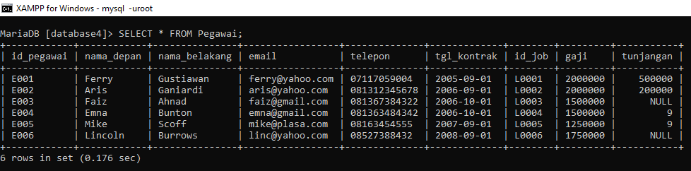

# TUGAS PRAKTIKUM

1. Tampilkan pegawai yang gajinya bukan 2.000.000 dan 1.250.000 !
- Script & Output :

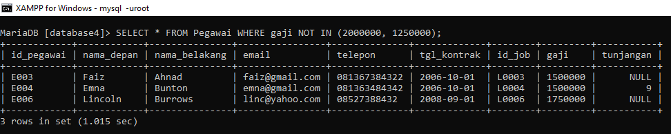

2. Tampilkan pegawai yang tunjangannya NULL!
- Script & Output :

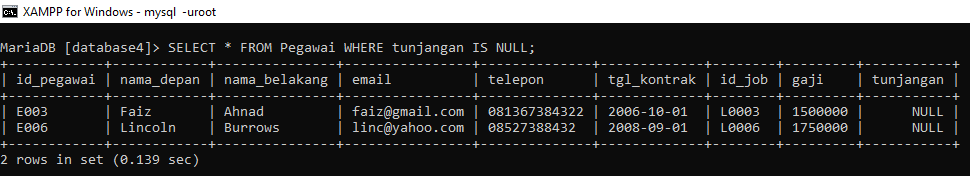

3. Tampilkan pegawai yang tunjangannya tidak NULL!
- Script & Output :

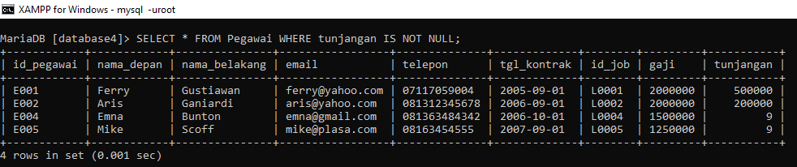

4. Tampilkan/hitung jumlah baris/record tabel pegawai!
- Script & Output :

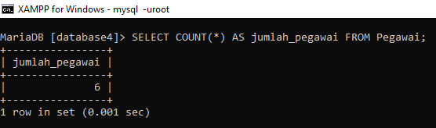

5. Tampilkan/hitung jumlah total gaji di tabel pegawai!
- Script & Output :

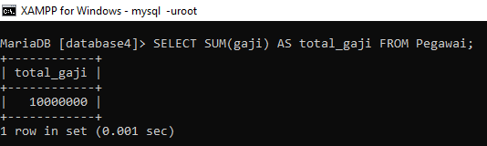

6. Tampilkan/hitung rata-rata gaji pegawai!
- Script & Output :

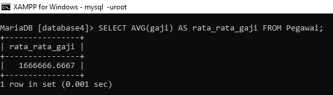

7. Tampilkan gaji terkecil!
- Script & Output :

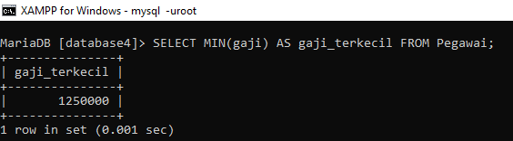

8. Tampilkan gaji terbesar!
- Script & Output :

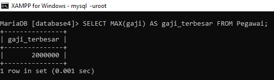

## Praktikum - Table Hewan


- Script :

```mysql
CREATE TABLE Animals (
  id VARCHAR(2),
  name VARCHAR(20),
  owner VARCHAR(20),
  species VARCHAR(20),
  sex CHAR(1)
);

INSERT INTO Animals (id, name, owner, species, sex)
VALUES ('p1', 'Puffball', 'Diane', 'Hamster', 'F'),
       ('p2', 'Claws', 'Gwen', 'Cat', 'M'),
       ('p3', 'Fluffy', 'Haro 1d', 'Cat', 'F'),
       ('p4', 'Buffy', 'Haro 1d', 'Dog', 'F'),
       ('p5', 'Fang', 'Benny', 'Dog', 'M'),
       ('p6', 'Bowser', 'Diane', 'Dog', 'M'),
       ('p7', 'Chirpy', 'Gwen', 'Bird', 'F'),
       ('p8', 'Whistler', 'Gwen', 'Bird', NULL),
       ('p9', 'Slim', 'Benny', 'Snake', 'M');
SELECT * from Animals;
```

- Output :
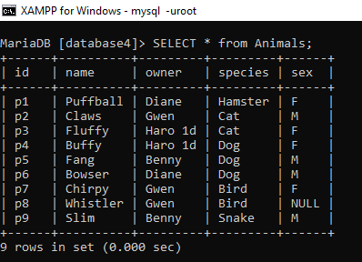

# TUGAS PRAKTIKUM

1. Tampilkan jumlah hewan yang dimiliki setiap owner
- Script & Output :

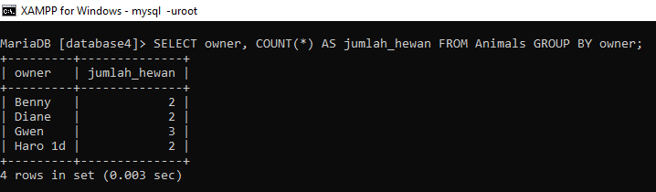

2. Tampilkan jumlah hewan berdasarkan spesies
- Script & Output :

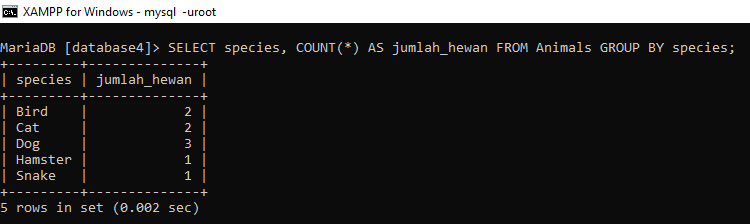

3. Tampilkan jumlah hewan berdasarkan jenis kelamin
- Script & Output :

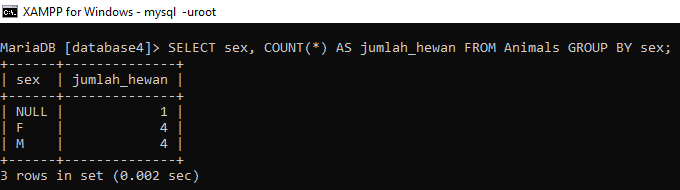

4. Tampilkan jumlah hewan berdasarkan spesies dan jenis kelamin
- Script & Output :

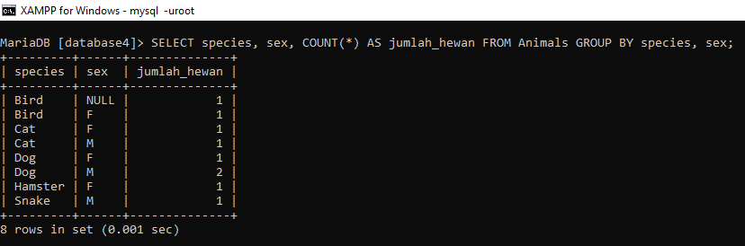

5. Tampilkan jumlah hewan berdasarkan spesis (cat dan dog saja) dan jenis kelamin
- Script & Output :

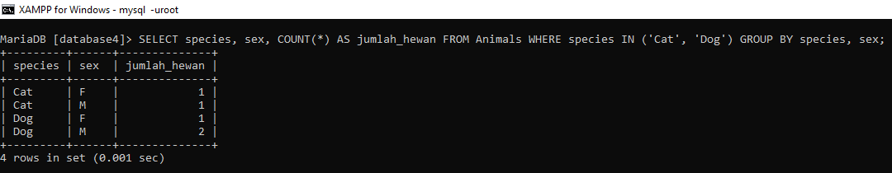

6. Tampilkan jumlah hewan berdasarkan jenis kelamin yang diketahui saja
- Script & Output :

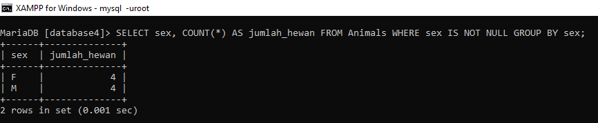

# KESIMPULAN

- Query filtering memungkinkan pengguna untuk mengurangi jumlah data yang diperoleh dari sumber data. Dengan mengaplikasikan kriteria tertentu, data yang relevan dapat disaring, sehingga menghindari pengambilan data yang tidak perlu.

- Dengan menggunakan query filtering, pengguna dapat memfokuskan pencarian pada data yang benar-benar relevan dengan kebutuhan mereka. Hal ini membantu meningkatkan efisiensi dan akurasi dalam pengambilan informasi.
